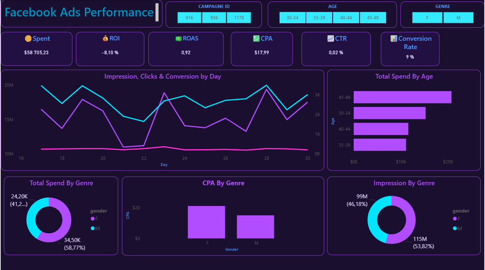

# FUTURE_DS_02

# Facebook Ads Performance Dashboard 📊

## 🌟 Project Overview
This project was developed as part of a marketing analytics internship task. The goal was to transform raw, messy Facebook Ads data into a high-impact, interactive dashboard to evaluate campaign performance, ROI, and audience engagement.

**Key Highlight:** This project involved advanced data cleaning to resolve a complex "column shift" issue in the source data using Power Query.

## 🛠️ Tech Stack
*   **Power BI Desktop**
*   **Power Query** (M Language for data transformation)
*   **DAX** (Data Analysis Expressions) for custom KPI metrics
*   **JSON** for custom UI/UX theming

## 🧹 Data Cleaning Process (The Technical Challenge)
The raw dataset contained a structural error where data shifted by two columns starting at a specific row index.
*   **Problem:** Data from `campaign_id` shifted into `age`, causing type errors and data misalignment.
*   **Solution:** Implemented a "Split & Realign" strategy in Power Query.
    *   Isolated corrupted rows using Indexing.
    *   Realigned columns and injected null values for missing campaign IDs.
    *   Appended the cleaned segments to restore a 100% accurate dataset.

## 📈 Key Metrics & DAX Formulas
Calculated essential marketing KPIs to drive business decisions:
*   **ROAS (Return on Ad Spend):** `[Total Revenue] / [Total Spent]`
*   **ROI (Return on Investment):** `([Total Revenue] - [Total Spent]) / [Total Spent]`
*   **CTR (Click-Through Rate):** `[Total Clicks] / [Total Impressions]`
*   **CPA (Cost Per Acquisition):** `[Total Spent] / [Total Approved Conversions]`

## 🎨 Dashboard Design
The dashboard follows a **"Deep Violet Modern UI"** theme, inspired by high-end social media analytics tools.
*   **Visual Hierarchy:** Top-level KPI cards for immediate performance overview.
*   **Trend Analysis:** Line & Area charts to track ROI and ROAS fluctuations.
*   **Audience Insights:** Demographic breakdowns (Age/Gender) to identify the most profitable segments.

## 💡 Strategic Insights & Recommendations
- Creative & Engagement Optimization (Critical)

Observation: The current Click-Through Rate (CTR) of 0.02% is significantly below industry benchmarks (typically 0.90% - 1.20%).
Action Plan: Immediate creative refresh is required. Implement A/B testing on ad copy and visual assets. Transition from static images to short-form video content (Reels/Stories) to capture attention and improve top-of-funnel engagement.

- Funnel Efficiency & Scaling

Observation: The Conversion Rate remains strong at 8.9%, indicating high post-click intent and a well-optimized landing page.
Action Plan: Since the backend of the funnel is performing well, focus entirely on scaling high-quality traffic. The primary bottleneck is the creative bridge between the ad and the website.

- Budget Realignment & Audience Targeting

Observation: Data shows high spending in the 45-49 age bracket and the Male segment, yet the overall ROI is currently negative (-22%).
Action Plan: Conduct a deep dive into CPA (Cost Per Acquisition) by demographic. Shift 20% of the budget from underperforming high-spend segments to the 30-39 age group to test for lower customer acquisition costs and improved profitability.

- Profitability Turnaround (ROAS Recovery)

Observation: The current ROAS of 0.78 indicates that for every $1 spent, the campaign returns only $0.78, leading to a net loss.
Action Plan: Immediate "Stop-Loss" strategy. Identify and pause ad sets with a ROAS below 0.5. Our immediate target is to achieve a Break-Even ROAS of 1.2 by optimizing ad delivery and reducing wasted spend on non-converting audiences.

## 🖼️ Dashboard Preview

---
## 🚀 How to use
1. Download the `.pbix` file.
2. Open with Power BI Desktop.
3. (Optional) Check the `Theme` folder for the JSON UI configuration.

**Author:** POZOU Ewaba Emmanuel
**LinkedIn:** www.linkedin.com/in/ewaba-emmanuel-pozou-b5b4ab344
